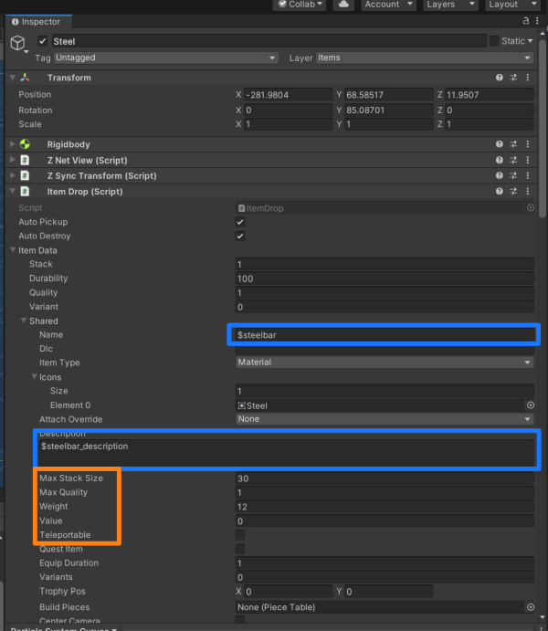
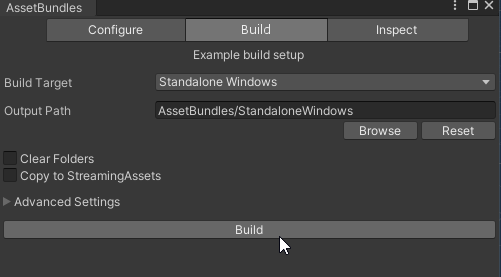

# Developing Assets with Unity

New Assets can be created with Unity and imported into Valheim using Jötunn. In this tutorial we will copy Valheim's "Iron Bar" and create a custom material "Steel Bar" to be used as a new item conversion. The final result can be downloaded and examined in our [mod example project](https://github.com/Valheim-Modding/JotunnModExample).

## Software Requirements

Creation Tools
* [Visual Studio](https://visualstudio.microsoft.com/de/downloads/) - editor for our plugin code
* [Unity 2019.4.24](https://unity3d.com/unity/whats-new/2019.4.24) - Game engine that Valheim runs in
* [uTinyRipper](https://sourceforge.net/projects/utinyripper/files/latest/download) - tool to rip assets and scripts from the release version of the game

Game Mods (install these into your game as our mod has dependencies on them)
* [Jötunn, the Valheim Library](https://valheim.thunderstore.io/package/ValheimModding/Jotunn/) - Mod with convenience methods we will use
* [HookGenPatcher](https://valheim.thunderstore.io/package/ValheimModding/HookGenPatcher/) - Patcher that adds convenient hooks to execute our mod code at the right times, that Jötunn relies on

## Summary of Steps

To add an item to the game, a mod maker will have to:
* Create an item asset in Unity
* Connect the required Valheim game scripts to the asset so that the game can interact with it
* Build the item into an Asset Bundle for importation into the Visual Studio project where they build the mod
* Retrieve the asset from the bundle in the mod code
* And add that item (and relevant recipes to make it) to the game's object database when it launches

## Unity Editor Setup

Valheim uses Unity Version **2019.4.24**

If you don't have Unity already installed, download [UnityHub](https://public-cdn.cloud.unity3d.com/hub/prod/UnityHubSetup.exe) from their website or install it with the Visual Studio Installer via `Individual Components` -> `Visual Studio Tools for Unity`. You will need an Unity account to register your PC and get a free licence. [Create the account](https://id.unity.com/account/new), login with it in UnityHub and get your licence via `Settings` -> `Licence Management`.

We will want to have two instances of the Unity Editor running, working in two different projects. This helps us separate the original, coyprighted content from the game and our own assets.

### Ripped Game Project

Create a ripped copy of the original game project by using [uTinyRipper](https://sourceforge.net/projects/utinyripper/files/latest/download). You can find [step-by-step instructions](https://github.com/Valheim-Modding/Wiki/wiki/Valheim-Unity-Project-Guide) on the Valheim-Modding Wiki. Make sure that you execute the ILSpy part and generate the disassembled scripts. After ripping and cleaning the project you can open this as a reference on the vanilla prefabs or to copy parts of the assets you want to use to your mod stub project.

We also need to inform Unity that the exported scripts are actually the assembly files. To do this you will need to create an assembly definition in each of your scripts folder. You do this by right clicking in the empty space at the bottom of Unity, Then select Create \> Assembly Definition.

It is very important you name your assembly definition the same as the folder title (so if it is assembly_googleanalytics as shown you would need to name your assembly definition file).

After you have gone through these folders and created an assembly definition for each folder you must link the one made for assembly_valheim to its counterparts. You do this by highlighting the assembly definition you have just created in your Scripts/assembly_valheim folder. On the right hand side of Unity you will notice the inspector. You will notice there is a slot that says “Assembly Definition References”. You need to fill this out in order to let Unity know that all these scripts tie together. It should look like this when done:

Do the same in the assembly_guiutils assembly definition, referencing assembly_utils:

### Mod Stub Project

Jötunn provides you with a barebone project stub which also includes a Unity project. You can get [that project in its entirety](https://github.com/Valheim-Modding/JotunnModStub) from our github. If you don't have already setup your dev environment, see our [Step-by-Step guide](../guides/guide.md) on how to do that.

Before opening the Unity project, copy the entire `Scripts` folder from your ripped Valheim project at `<RippedValheimProject>\Assets` into your stub project's `<ValheimModStub>\ValheimModUnity\Assets` folder. This enables us to exchange prefabs between the two projects without losing the references to the added Components. 

 **Copy the folder to the new project directly via the filesystem - don't import the scripts via Unity**.

After you copied the scripts, open UnityHub, add the ValheimModUnity project and open it. For easy packaging, install the `AssetBundle Browser` package in the Unity Editor via `Window`-> `Package Manager`.

## Working the New Asset

In this use case you only need to edit some line items on the prefab that we are manipulating. So locate the Iron bar made by IronGate in the ripped game project. Highlight the item and press CTRL+D to duplicate it in Unity. Double click the copied Prefab to open it in the inspector. This is our new working base for the Steel Ingot. Now change the values of the ItemData component according to your needs:

* The name: as you can see its a token that is prefixed with \$ . This dollar     signifies this is a token due for replacement by localised content. In my case I changed the name to \$steelbar
* Icons: Its an array that is the same size as the number of variant you'll want for you item, if there is only 1 variant, have a single entry in there and drag and drop your 2D Sprite at the Element 0 field. (IF YOU FORGET THIS YOUR INVENTORY WILL BE VERY ANGRY WITH YOU UPON PICKUP OF THE ITEM)
* Description Token: same thing for the name, mine is \$steelbar\_description
* Item Type: The item type in use here is extremely important to our in-game use case. Since we are creating a Material that is what I should pick here. The attach override is not important for this example.
* Max Stack size: Determines the maximum the player can have in 1 stack in the inventory
* Weight: The weight factor for a single unity
* Teleportable: Whether or not this item can pass through a teleporter

## Porting the Asset

Port the item into the new stubbed unity project, with ALL linked assets (mesh, texture, sound, material, etc). You can do this by creating a .unitypackage export from the ripped project and importing that again in the stub project. Do so by right-clicking the Prefab and selecting `Export Package`. Dont include the scripts in the package since we copied these before. If you want to copy single assets you can also drag and drop them from one unity editor instance to the other. The stub project will be the project from which we make the Asset Bundle to package with our plugin.

Before we actually create our bundle, though, you might be wondering - what should I do with the copied vanilla assets. I'd have to be worried about copyright infringement, bad.

The solution is easy though, thanks to [JVL](https://github.com/Valheim-Modding/Jotunn), we introduce a [Mock object system](asset-mocking.md). Click the link to learn more about resolving native asset references at runtime.

## AssetBundle

Now we want to make our AssetBundle so that we later inject it with our BepInEx plugin dll

Let's create an Asset Label for the AssetBundle that we'll call steel:

Now, let's use the AssetBundle Browser made by Unity to create our AssetBundle.

Window -\> AssetBundle Browser -\> Build Tab -\> Build

We now want to put our AssetBundle into the Visual Studio project so we can use it later with our custom Jötunn code. Alternatively you can just build your asset bundles directly into the VS project path.

## Implementing your asset ingame using JVL

If you have not done so yet, please ensure you have completed the [relevant visual studio setup](../guides/guide.md).
You can then follow the [Asset importing guide](asset-loading.md), [Item Creation](items.md), and [Localization](localization.md) tutorials.