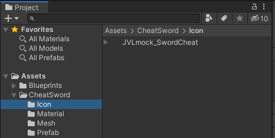
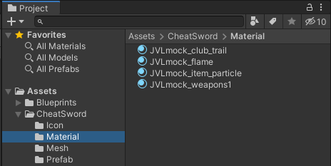
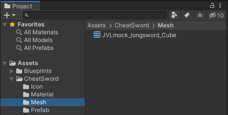
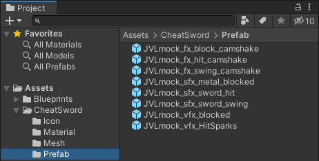
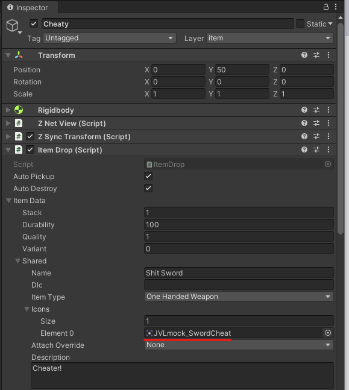

# Mock References

What are mock references? What do they do? What do they solve?

Mock's are placeholder objects which you create inside of asset bundles, and prepend the specific `JVLmock_` prefix to the name of an already existing prefab.
When we load our assets at runtime, any references to mock objects will be recursively resolved until a depth of 3.
When resolving references, we iterate through scene objects attempting to match our objects name with an existing one in the scene, and then duplicate the asset such that we may use it for our own purposes, without needing to copy copyrighted content within our own custom assets!
Neat right?!
And better yet, we don't even need to code anything ourselves to do this, just make sure that you set the `fixReference` bool on any `Custom*` entities to true and the mock reference will automatically be resolved at runtime.

## Mocked Assets

For this example we took the Cheat Sword of Valheim and added it to the game again as a new item using only mocked assets.
You can check out the result in our [example mod's](https://github.com/Valheim-Modding/JotunnModExample) Unity project.
Note that the example mod uses its own Unity project for mod assets. Please read the [asset creation guide](asset-creation.md) on how to setup such a mod project yourself.

We'll start by creating a folder that will hold all our new asset, let's call it `CheatSword`.
We now want to drag and drop the existing asset from the ripped game project to our custom item project.
The original asset is called `SwordCheat`.
Open the ripped project, search for that prefab and drop onto the newly created folder in your working project.
Rename the prefab to something different than the vanilla prefab, we used `Cheaty` as the name.

Open the prefab by double-clicking it.
If you followed our [asset creation guide](asset-creation.md), all references to the vanilla scripts should still be there.
If this is not the case, your prefab now looks something like this:


You will have to fix those script references first.
Be sure to **always fix the script references for all items that you've brought into the new project** including ItemDrop, etc.
Doing this manually unfortunately clears out all values previously set on those components.
To avoid this, you can use the Unity package [NG Script recovery](https://assetstore.unity.com/packages/tools/utilities/ng-missing-script-recovery-102272)
Install it and let NG fix the references.
We won't go into details of that process, so please read up on NG usage on their website.

After fixing the script references for the cheat sword (if needed), you will still have stuff missing.
This is where the mocks come into play.
For Jötunn to resolve the vanilla assets for you at runtime, we need to create corresponding assets inside our project, reference them inside our components and tell Jötunn to fix those references for us.
Let's look at the vanilla icon reference in the ItemDrop component for example:


Identify all references on all GameObjects of your prefab gone "Missing" like this.
In case of the Cheat Sword, those were `Icons`, `Materials`, a `Mesh` and some `fx Prefabs`.
Create folders for all of those types and create empty objects using the same type as the previous referenced asset.
It is important that you name those objects exactly like the vanilla objects you want to reference and prefix those with `JVLmock_`.
This is how that looks for our sword:

 

 

Now assign all mocked objects in the components of your custom prefab instead of the vanilla objects.
Replace the icon reference with the newly created mock icon, the material reference with the newly created mock material and so on.
This is how our missing icon reference should look like now for example:



That's it.
When importing your prefabs into the game, Jötunn will automatically reference the vanilla objects for you at runtime.
Please make sure you set `fixReference: true` when you create your custom entities:

```cs
private void AddMockedItems()
{
    // Load completely mocked "Shit Sword" (Cheat Sword copy)
    var cheatybundle = AssetUtils.LoadAssetBundleFromResources("cheatsword");
    var cheaty = cheatybundle.LoadAsset<GameObject>("Cheaty");
    ItemManager.Instance.AddItem(new CustomItem(cheaty, fixReference: true));
    cheatybundle.Unload(false);
}
```

> [!NOTE]
> You don't need to copy vanilla prefabs in order to use mocked references. You can facilitate the system using you own prefabs, too. Just make sure to create a custom entity using that prefab (CustomPrefab, CustomItem, etc) and set the fixReference parameter to true.

If you have been following the Unity Asset Creation guide, you can return back to where you [left off](asset-creation.md#assetbundle).

## Shader Mocking
The only special case is shader mocking for custom materials.
The asset name isn't their object name, which means that renaming it will not result in a valid mock.

Instead, create a new stump shader or use the dummy shader from AssetRipper and change the first line to contain the `JVLmock_` prefix.
If you don't have dummy shaders but yaml shaders, set AssetRipper to export dummy shaders instead and make a second rip to copy them over.
Now you can use this shader as normally on your materials and Jötunn will resolve the right Shader for you.
Properties that are set on the material will be used by the resolved shader.

This is a mock for the piece shader as an example:

```
Shader "JVLmock_Custom/Piece" {
	Properties {
		_Color ("Color", Vector) = (1,1,1,1)
		_Cutoff ("Alpha Cutoff", Range(0, 1)) = 0
		_MainTex ("Albedo (RGB)", 2D) = "white" {}
		_MetallicTex ("Metallic", 2D) = "white" {}
		_Metallic ("Metallic", Range(0, 1)) = 0
		_MetallicAlphaGloss ("Metal smoothness", Range(0, 1)) = 0
		[HDR] _MetalColor ("Metal color", Vector) = (1,1,1,1)
		_BumpMap ("Normal Map", 2D) = "bump" {}
		_BumpScale ("Normal intensity", Float) = 1
		_Glossiness ("Smoothness", Range(0, 1)) = 0.5
		_EmissionColor ("Emissive", Vector) = (0,0,0,0)
		_RippleDistance ("Noise distance", Float) = 0
		_RippleFreq ("Noise freq", Float) = 1
		_ValueNoise ("ValueNoise", Float) = 0.5
		[MaterialToggle] _ValueNoiseVertex ("Value noise per vertex", Float) = 0
		[MaterialToggle] _TwoSidedNormals ("Twosided normals", Float) = 0
		[Enum(Off,0,Back,2)] _Cull ("Cull", Float) = 2
		[MaterialToggle] _AddRain ("Add Rain", Float) = 1
		_NoiseTex ("Noise", 2D) = "white" {}
	}
	//DummyShaderTextExporter
	SubShader{
		Tags { "RenderType"="Opaque" }
		LOD 200
		CGPROGRAM
#pragma surface surf Standard
#pragma target 3.0

		sampler2D _MainTex;
		fixed4 _Color;
		struct Input
		{
			float2 uv_MainTex;
		};
		
		void surf(Input IN, inout SurfaceOutputStandard o)
		{
			fixed4 c = tex2D(_MainTex, IN.uv_MainTex) * _Color;
			o.Albedo = c.rgb;
			o.Alpha = c.a;
		}
		ENDCG
	}
}
```
