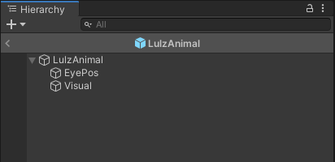
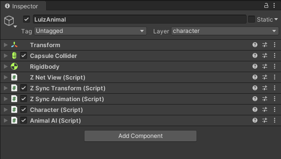

# Creatures

A _Creature_ is a prefab representing an enemy, animal or NPC in Valheim. Creatures can be used in various spawning classes where certain conditions have to be fulfilled to instantiate those prefabs into the game. Jötunn provides an API for validating and adding custom creature prefabs to the game via the [CustomCreature](xref:Jotunn.Entities.CustomCreature) class using the [CreatureManager](xref:Jotunn.Managers.CreatureManager). Basic spawn conditions can be defined by adding [spawn configurations](xref:Jotunn.Configs.SpawnConfig) to those custom creature prefabs as well as drop lists using [drop configs](xref:Jotunn.Configs.DropConfig).

**Note**: The Unity screens and code snippets are taken from our [example mod](https://github.com/Valheim-Modding/JotunnModExample).

## Creating Creature Prefabs

A prefab has to match certain criteria and has to follow a certain layout to be recognized as a creature prefab by Valheim. Those requirements are absoultely mandatory as part of the game code. A minimal creature prefab layout looks like this:



The base prefab consists of the prefab root GameObject and at least two child objects for the eye position and the visual part of the prefab (the armature and model).

### Base Components

The root GameObject of the prefab has several mandatory components attached:



Instead of using the `Character` component you can use any derived class (`Humanoid` for example). The same applies for the `AnimalAI` used in the screenshot, which is derived from `BaseAI` which is the absolute minimum a creature has to have (the other component currently in the game being `MonsterAI`).

### EyePos

The first child GO of the creature prefab is `EyePos` and does not have any mandatory components itself but is a mandatory reference used in the `Character` component:


### Visual

The second child GO `Visual` also has some mandatory components. Those are normally not attached at this level of the prefab structure as the `Visual` part is usually holding the armature and model of a prefab which each consist of further GOs when using more complex creature prefabs. To keep it simple for this minimal example, the mandatory components as well as the model components are attached to this single child GO as follows:


When validating the creature prefab the game looks for the `Animator` and `CharacterAnimEvent` component at any level of the prefab's GO hierarchy.

### Additional Considerations

There are some "gotcha"'s when creating more complex creatures.

* Certain child GameObjects have to be added to the `character` layer for the game's collision and attack calculations (and probably more use cases). Jötunn will set the base GO and the first level of child GOs to this layer automatically for you. There is also the static [CreatureManager.CharacterLayer](xref:Jotunn.Managers.CreatureManager.CharacterLayer) field for mods to assign this layer in code.
* Creatures wanting to use Valheim's `Tameable` and `Procreation` components must have a functioning `MonsterAI` component, too.

## Adding Custom Creature Prefabs

After preparing the creature prefab using the minimal requirements, we will load and import the prefab as a [CustomCreature](xref:Jotunn.Entities.CustomCreature). This can be done as early as the mods Awake() call. All loaded creature prefabs added to the [CreatureManager](xref:Jotunn.Managers.CreatureManager) are kept between world loads. The most basic use case is to only add a prefab using as a custom creature and define if Jötunn should [resolve mock references](asset-mocking.md). In our example we opted to also define world spawning and a drop table for this creature by providing a [CreatureConfig](xref:Jotunn.Configs.CreatureConfig).

```cs
private void Awake()
{
    // Create custom creatures and spawns
    AddCustomCreaturesAndSpawns();
}

// Add custom made creatures using world spawns and drop lists
private void AddCustomCreaturesAndSpawns()
{
    AssetBundle creaturesAssetBundle = AssetUtils.LoadAssetBundleFromResources("creatures", typeof(TestMod).Assembly);
    try
    {
        // Create creature from AssetBundle
        var lulzThing = creaturesAssetBundle.LoadAsset<GameObject>("LulzThing");

        // Set our lulzcube test texture on the first material found
        var lulztex = AssetUtils.LoadTexture("TestMod/Assets/test_tex.jpg");
        lulzThing.GetComponentInChildren<MeshRenderer>().material.mainTexture = lulztex;
        
        // Create a custom creature with one drop and two spawn configs
        var cubeCreature = new CustomCreature(lulzThing, false,
            new CreatureConfig
            {
                Name = "LulzThing",
                DropConfigs = new []
                {
                    new DropConfig
                    {
                        Item = "Sausages",
                        Chance = 50f,
                        LevelMultiplier = false,
                        MinAmount = 2,
                        MaxAmount = 3,
                        //OnePerPlayer = true
                    }
                },
                SpawnConfigs = new []
                {
                    new SpawnConfig
                    {
                        Name = "Jotunn_LulzSpawn1",
                        SpawnChance = 100,
                        SpawnInterval = 1f,
                        SpawnDistance = 1f,
                        MaxSpawned = 10,
                        Biome = Heightmap.Biome.Meadows
                    },
                    new SpawnConfig
                    {
                        Name = "Jotunn_LulzSpawn2",
                        SpawnChance = 50,
                        SpawnInterval = 2f,
                        SpawnDistance = 2f,
                        MaxSpawned = 5,
                        Biome = Biome = ZoneManager.AnyBiomeOf(Heightmap.Biome.BlackForest, Heightmap.Biome.Plains)
                    }
                }
            });
        CreatureManager.Instance.AddCreature(cubeCreature);
    }
    catch (Exception ex)
    {
        Logger.LogWarning($"Exception caught while adding custom creatures: {ex}");
    }
    finally
    {
        creaturesAssetBundle.Unload(false);
    }
}
```

## Modifying and Cloning Vanilla Creatures

You can get vanilla creatures and either clone them or modify the original to change any aspect of that creature you want. To make sure all vanilla creature prefabs are loaded, use the [provided event OnVanillaCreaturesAvailable](xref:Jotunn.Managers.CreatureManager.OnVanillaCreaturesAvailable).

Cloned creatures keep their components as they are but don't copy any existing spawn data for that creature. If you don't provide a new DropConfig for the cloned creature, all vanilla drops are kept. Providing a new DropConfig completely overrides all vanilla drops.

Since creature prefabs are loaded globally and Jötunn keeps all added creatures for the game session after adding them once, you can unsubscribe from the event after its first execution. Keep in mind that other mods could alter vanilla cratures, too, so it might be required to modify vanilla creatures on every event execution.

```cs
private void Awake()
{
    // Hook creature manager to get access to vanilla creature prefabs
    CreatureManager.OnVanillaCreaturesAvailable += ModifyAndCloneVanillaCreatures;
}

// Modify and clone vanilla creatures
private void ModifyAndCloneVanillaCreatures()
{
    try
    {
        // Clone a vanilla creature with and add new spawn information
        var lulzeton = new CustomCreature("Lulzeton", "Skeleton_NoArcher",
            new CreatureConfig
            {
                SpawnConfigs = new []
                {
                    new SpawnConfig
                    {
                        Name = "Jotunn_SkelSpawn1",
                        SpawnChance = 100,
                        SpawnInterval = 1f,
                        SpawnDistance = 1f,
                        Biome = Heightmap.Biome.Meadows,
                        MinLevel = 3
                    }
                }
            });
        var lulzoid = lulzeton.Prefab.GetComponent<Humanoid>();
        lulzoid.m_walkSpeed = 0.1f;
        CreatureManager.Instance.AddCreature(lulzeton);

        // Get a vanilla creature prefab and change some values
        var goblin = CreatureManager.Instance.GetCreaturePrefab("Skeleton_NoArcher");
        var humanoid = goblin.GetComponent<Humanoid>();
        humanoid.m_walkSpeed = 2;
    }
    catch (Exception ex)
    {
        Logger.LogWarning($"Exception caught while modifying vanilla creatures: {ex}");
    }
    finally
    {
        // Unregister the hook, modified and cloned creatures are kept over the whole game session
        CreatureManager.OnVanillaCreaturesAvailable -= ModifyAndCloneVanillaCreatures;
    }
}
```

## Drop Configurations

You can add one or more [SpawnConfigurations](xref:Jotunn.Configs.DropConfig) to your custom creature. Drops are items a creature leaves behind on its death. You must provide a prefab name for the drop as a string, Jötunn resolves that prefab at runtime for you.

There are also additional properties to further the drops for the creature:

|Property|Effect|Default
|---|---|---
|MinAmount<br>MaxAmount|How many of the drop items should be spawned|1
|Chance|The chance of this drop in percent|100
|OnePerPlayer|Should the drop be multiplied so every player gets the same amount|false
|LevelMultiplier|Should the drop amount be multiplied by the creature level|true

## Spawn Configurations

While adding creatures with Jötunn you can define one or more basic spawn configurations. Those configurations are added to the world spawn list so your creatures spawn into the world automatically. You must at least provide an unique name for your spawn configuration and a spawning biome.

There are plenty of properties to refine your spawn configuration:

|Property|Effect|Default
|---|---|---
WorldSpawnEnabled|If set to false, Jötunn creatres the SpawnData for this config but disables the actual spawn.|true
Biome|Biome for your creature to spawn in. Multiple biomes per spawn config are possible.<br>To get the correct value for this property, you can use [ZoneManager.AnyBiomeOf](xref:Jotunn.Managers.ZoneManager.AnyBiomeOf).|
BiomeArea|Uses the Heightmap.BiomeArea enum to define if the spawn should be in the middle, on the edges or everywhere on the spawning biomes.|Heightmap.BiomeArea.Everywhere
MaxSpawned|How many instances of this creature can be spawned in a biome at the same time.|1
SpawnInterval|Seconds between new spawn checks.|4f
SpawnChance|Spawn chance each spawn interval in percent.|100f
SpawnDistance|Minimum distance to another instance.|10f
MinSpawnRadius<br>MaxSpawnRadius|Min/max distance from player to spawn at. 0 equals the global default of 40.<br>A specific player is chosen as a target, this setting basically creates a ring around the player, in which a spawn point can be chosen|0<br>0
MinLevel<br>MaxLevel|Min/max level the creature spawns with.<br>Level is assigned by rolling levelup-chance for each level from min, until max is reached.|1<br>1
RequiredGlobalKey|Only spawn if this key is set.<br>See [GameConstants.GlobalKey](xref:Jotunn.Utils.GameConstants.GlobalKey) for constant values|
RequiredEnvironments|Only spawn if one of this environments is active.<br>See [GameConstants.Weather](xref:Jotunn.Utils.GameConstants.Weather) for constant values|
MinGroupSize<br>MaxGroupSize|Min/Max number of entities to attempt to spawn at a time.|1<br>1
GroupRadius|Radius of circle, in which to spawn a pack of entities<br>Eg., when group size is 3, all 3 spawns will happen inside a circle indicated by this radius.|3f
SpawnAtDay|Can spawn during day.<br>Note: If not true, creatures with MonsterAI will attempt to despawn at day)|true
SpawnAtNight|Can spawn during night|true
MinAltitude<br>MaxAltitude|The min/max altitude (distance to water surface) for the creature to spawn|-1000f<br>1000f
MinTilt<br>MaxTilt|The min/max tilt of terrain required to spawn. Tested multiple times to decide where to spawn entity.|35f
MinOceanDepth<br>MaxOceanDepth|The min/max ocean depth for the creature to spawn. Ignored if min == max.|0<br>0
SpawnInForest|Spawn can happen in forest areas.|true
SpawnOutsideForest|Spawn can happen outside of forest areas.|true
HuntPlayer|Set true to let the AI hunt the player on spawn.|false
GroundOffset|Offset to the ground the creature spawns on|0.5f


Jötunn's spawn configuration covers all of the game's default spawning options. To have much tighter control of your creature spawns, we recommend using the [SpawnThat! mod](https://www.nexusmods.com/valheim/mods/453) by A Sharp Pen.