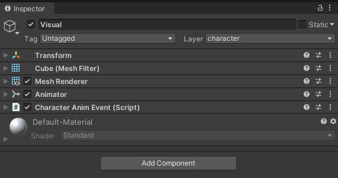

# Creatures

A _Creature_ is a prefab representing an enemy, animal or NPC in Valheim. Creatures can be used in various spawning classes where certain conditions have to be fulfilled to instantiate those prefabs into the game. Jötunn provides an API for validating and adding custom creature prefabs to the game via the [CustomCreature](xref:Jotunn.Entities.CustomCreature) class using the [CreatureManager](xref:Jotunn.Managers.CreatureManager). Basic spawn conditions can be defined by adding [spawn configurations](xref:Jotunn.Configs.SpawnConfig) to those custom creature prefabs as well as drop lists using [drop configs](xref:Jotunn.Configs.DropConfig).

**Note**: The Unity screens and code snippets are taken from our [example mod](https://github.com/Valheim-Modding/JotunnModExample).

## Creating Creature Prefabs

A prefab has to match certain criteria and has to follow a certain layout to be recognized as a creature prefab by Valheim. Those requirements are absoultely mandatory as part of the game code. A minimal creature prefab layout looks like this:


The base prefab consists of the prefab root GameObject and at least two child objects for the eye position and the visual part of the prefab (the model). Also note the separate `PhysicsMaterial` asset called `JVLmock_charactermat` which is used in the `CapsuleCollider` of the prefab as a [mocked component](asset-mocking.md) and can be used in multiple creature prefabs:


### Base Components

The root GameObject of the prefab has several mandatory components attached:


Instead of using the `Character` component you can use any derived class (`Humanoid` for example). The same applies for the `AnimalAI` used in the screenshot, which is derived from `BaseAI` which is the absolute minimum a creature has to have (the other component currently in the game being `MonsterAI`).

### EyePos

The first child GO of the creature prefab is `EyePos` does not have any mandatory components itself but is a mandatory reference used in the `Character` component:


### Visual

The second child GO `Visual` also has some mandatory components. Those are normally not attached at this level of the prefab structure as the `Visual` part is usually holding the armature and model of a prefab which each consist of further GOs when using more complex creature prefabs. To keep it simple for this minimal example, the mandatory components as well as the model components are attached to this single child GO as follows:



When validating the creature prefab the game looks for the `Animator` and `CharacterAnimEvent` component at any level of the prefab's GO hierarchy.

## Adding Custom Creature Prefabs

After preparing the creature prefab using the minimal requirements, we will load and import the prefab as a [CustomCreature](xref:Jotunn.Entities.CustomCreature). This can be done as early as the mods Awake() call. All loaded creature prefabs added to the [CreatureManager](xref:Jotunn.Managers.CreatureManager) are kept between world loads. The most basic use case is to only add a prefab using as a custom creature and define if Jötunn should [resolve mock references](asset-mocking.md). In our example we opted to also define world spawning and a drop table for this creature by providing a [CreatureConfig](xref:Jotunn.Configs.CreatureConfig).

```cs
private void Awake()
{
    // Create custom creatures and spawns
    AddCustomCreaturesAndSpawns();
}

// Add custom made creatures using world spawns and drop lists
private void AddCustomCreaturesAndSpawns()
{
    AssetBundle creaturesAssetBundle = AssetUtils.LoadAssetBundleFromResources("creatures", typeof(TestMod).Assembly);
    try
    {
        // Create creature from AssetBundle
        var cubeThing = creaturesAssetBundle.LoadAsset<GameObject>("LulzThing");
        cubeThing.GetComponentInChildren<MeshRenderer>().material.mainTexture = TestTex;
        var cubeCreature = new CustomCreature(cubeThing, false,
            new CreatureConfig
            {
                Name = "LulzThing",
                DropConfigs = new []
                {
                    new DropConfig
                    {
                        Item = "ArmorStand_Male"
                    }
                },
                SpawnConfigs = new[]
                {
                    new SpawnConfig
                    {
                        Name = "LulzSpawn1",
                        SpawnChance = 100,
                        SpawnInterval = 1f,
                        SpawnDistance = 1f,
                        Biome = Heightmap.Biome.Meadows
                    },
                    new SpawnConfig
                    {
                        Name = "LulzSpawn2",
                        SpawnChance = 100,
                        SpawnInterval = 1f,
                        SpawnDistance = 1f,
                        Biome = Heightmap.Biome.BlackForest
                    }
                }
            });
        CreatureManager.Instance.AddCreature(cubeCreature);
    }
    catch (Exception ex)
    {
        Logger.LogWarning($"Exception caught while adding custom creatures: {ex}");
    }
    finally
    {
        creaturesAssetBundle.Unload(false);
    }
}
```
