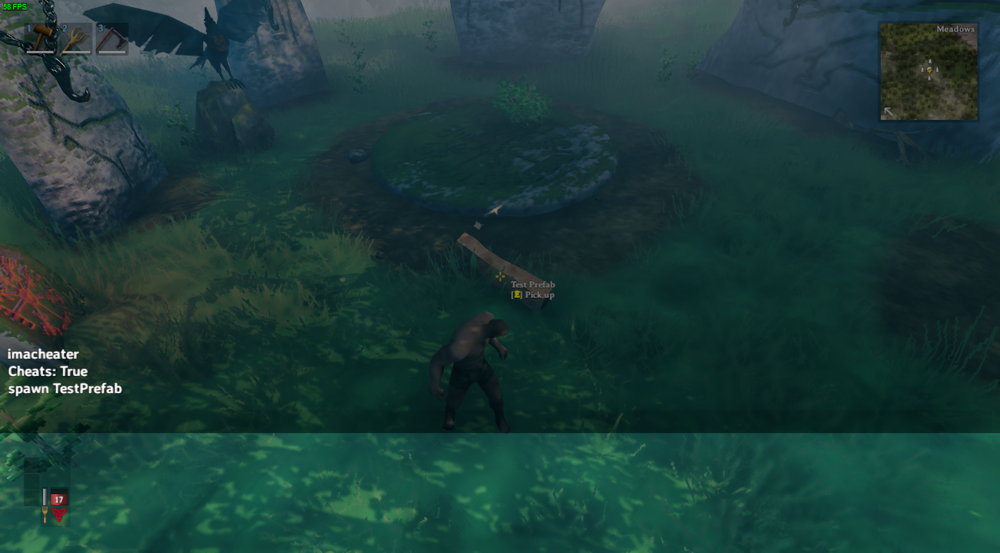

# Registering custom prefabs
_Prefabs_ in Valheim are objects that can be instantiated and used within the world. This includes everything from inventory items, placeable items (Pieces), entities, etc.  

_Note: In order to create Pieces, Inventory items, Vegetation, or nearly anything, it **must** have a prefab created first._

Creation/management of prefabs is done through the [PrefabManager](xref:JotunnLib.Managers.PrefabManager) singleton class.

Prefabs can be created by creating a handler within your mod's `Awake` function for the [PrefabRegister](xref:JotunnLib.Managers.PrefabRegister) event.

## Existing prefabs
For a list of existing in-game prefabs, check [this handy Reddit thread](https://www.reddit.com/r/valheim/comments/lig8ml/spawn_item_command_list/). The prefab names are the same as their names when using the `spawn` console command.

## Example
In order to create a prefab, there's a couple different approaches:
- [PrefabConfig approach](#prefabconfig-approach): using a [PrefabConfig](xref:JotunnLib.Entities.PrefabConfig) to hold our Prefab info
- [CreatePrefab approach](#createprefab-approach): Using the `CreatePrefab` functions

Below we'll look at both ways of creating the exact same prefab. You'll notice that the functional approach may look neater, however, it gets unwieldy fairly quickly when you register many prefabs within the same file - hence the PrefabConfig approach is recommended.

### PrefabConfig approach
First, creating our prefab class that inherits from [PrefabConfig](xref:JotunnLib.Entities.PrefabConfig). We need to then implement a default constructor, as well as the `void Register()` method.  

Within our constructor, we can call the `base` constructor with either one or two arguments:
- `base(String ourPrefabName)`: Creating an empty prefab with no base object
- `base(String ourPrefabName, String baseName)`: Creating a prefab that's a copy of the base

Next, we can implement our `void Register()` method. In here, we can make any changes we need to the prefab, such as adding components or modifying existing components.  

To do this, we can use the member variable `Prefab` that's of type `GameObject`. This is set for us after our constructor is called. If we're inheriting an existing prefab, `Prefab` will be a copy of what we've inherited. Otherwise, it'll be an empty `GameObject`.

```cs
public class TestPrefab : PrefabConfig
{
    public TestPrefab() : base("TestPrefab", "Wood")
    {
        // Nothing to do here
        // "Prefab" wil be set for us automatically after this is called
    }

    public override void Register()
    {
        // Configure item drop
        // ItemDrop is a component on GameObjects which determines info about the item when it's picked up in the inventory
        ItemDrop item = Prefab.GetComponent<ItemDrop>();
        item.m_itemData.m_shared.m_name = "Test Prefab";
        item.m_itemData.m_shared.m_description = "We're using this as a test";
        item.m_itemData.m_dropPrefab = Prefab;
        item.m_itemData.m_shared.m_weight = 1f;
        item.m_itemData.m_shared.m_maxStackSize = 1;
        item.m_itemData.m_shared.m_variants = 1;
    }
}
```

Next, creating a handler for [PrefabRegister](xref:JotunnLib.Managers.PrefabRegister)

```cs
private void Awake()
{
    // Register our handler
    PrefabManager.Instance.PrefabRegister += registerPrefabs;
}

private void registerPrefabs(object sender, EventArgs e)
{
    // Create a new instance of our TestPrefab
    PrefabManager.Instance.RegisterPrefab(new TestPrefab());
}
```

### CreatePrefab approach
First, creating a handler for [PrefabRegister](xref:JotunnLib.Managers.PrefabRegister)

```cs
private void Awake()
{
    // Register our handler
    PrefabManager.Instance.PrefabRegister += registerPrefabs;
}

private void registerPrefabs(object sender, EventArgs e)
{
   // Prefab init code goes here 
}
```

Next, we need to actually create our prefab game object

```cs
private void registerPrefabs(object sender, EventArgs e)
{
    // Prefab init code goes here
    GameObject prefab = PrefabManager.Instance.CreatePrefab("TestPrefab", "Wood");

    ItemDrop item = prefab.GetComponent<ItemDrop>();
    item.m_itemData.m_shared.m_name = "Test Prefab";
    item.m_itemData.m_shared.m_description = "We're using this as a test";
    item.m_itemData.m_dropPrefab = Prefab;
    item.m_itemData.m_shared.m_weight = 1f;
    item.m_itemData.m_shared.m_maxStackSize = 1;
    item.m_itemData.m_shared.m_variants = 1;
}
```

### Our prefab in game
That's it!  
Now if we go in-game and type `spawn TestPrefab` in our console, it'll spawn what looks to be a piece of wood on the ground. In fact, this is the item we've just created! It however looks like a piece of wood since we copied the existing `Wood` prefab, and did not change its model.

