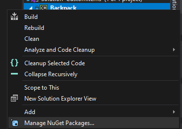

# Developer's Quickstart for transitioning a project to Jötunn

Different developers prefer to reference their dependencies in different manners, for different use cases and situations. This guide is meant to provide a consistent experience for dependency acquisition for both beginners, and experienced developers.

### Manual Dependency Acquisition (experienced developers)
This method is for those who prefer to explicitly manage their project dependencies. You can simply add the Jötunn NuGet, and instead of creating `Environment.props`, make sure the file does not exist in the solution root, this will prevent the nuget from adding unwanted dependencies. You can then just ensure the `PreBuild.props` is set to false, or is deleted.

Done! Your project is now all set to use Jötunn!


### Nuget Installation

The first thing we advise going forwards, is to enable your project to reference file locations through an `Environment.props` like such:

```xml
<?xml version="1.0" encoding="utf-8"?>
<Project ToolsVersion="Current" xmlns="http://schemas.microsoft.com/developer/msbuild/2003">
  <PropertyGroup>
    <!-- Needs to be your path to the base Valheim folder -->
    <VALHEIM_INSTALL>X:\PathToYourSteamLibary\steamapps\common\Valheim</VALHEIM_INSTALL>
  </PropertyGroup>
</Project>
```

and to then import this reference into your project by adding: `<Import Project="../Environment.props" Condition="'$(VALHEIM_INSTALL)' == ''" />` to your .csproj

#### depenencies

If you are new to Nuget, its all actually pretty simple!

- Right click on your project, and select *Manage Nuget Packages* <br />
- Click on *Browse* tab in the main pane, then type Jotunn to search for our nuget. Ensure that *Include Pre-Release* is unchecked.<br /> and then select *Install* in the right hand pane.
- Jotunn should now be installed as a depenency for your project, and the `Jotunn` namespace should be resolved.


### Prebuild automation
Jötunn provides many forms of automation to assist developer workflow. One of these, is a pre-build task that will 
automatically generate, reference, and resolve all dependencies that may be needed for the development process, including `MonoMod`'s hooks, and publicized assemblies.

```xml
<?xml version="1.0" encoding="utf-8"?>
<Project ToolsVersion="Current" xmlns="http://schemas.microsoft.com/developer/msbuild/2003">
  <PropertyGroup>
    <ExecutePrebuild>true</ExecutePrebuild>
  </PropertyGroup>
</Project>
```

**WARNING:** _If you already have references to BepInEX and Valheim, this task will most certainly duplicate them. If you intend to use our prebuild automations, you should remove all references now._

**WARNING:** _This prebuild task will automate the generation of monomod method detours and publicising of game assemblies. By enabling this, you understand that you will be generating new publicised assemblies and method detours upon PreBuild **IF** the binaries have been updated since the last time the PreBuild has run._

#### First Build dependency acquisition
Even if you have errors in your project, you should still build the solution and ensure that the PreBuild task has run and completed successfully. You can ensure it has run by deleting the MMHook directory inside of `Plugins` and watch it get regenerated as you build the solution.

After the PreBuild has run, and dependencies have been generated, they are automatically referenced via Jötunn. They are generated inside of your game directory, and will ensure that your mods are always built against the latest version of the game.

Done! You should now have all of your required dependencies resolved, such as BepInEx, Harmony, Monomod, Publicised assemblies, Unity corelibs, and Jotunn!

#### BepInDependency

Don't forget to add dependency tags for bepin and compatibility! This will ensure your mod throws an error if installed without Jotunn. Click for more information about [NetworkCompatibilty](../../tutorials/utils/NetworkCompatibility.md).
```cs
[BepInDependency(Jotunn.Main.ModGuid)]
[NetworkCompatibilty(CompatibilityLevel.EveryoneMustHaveMod, VersionStrictness.Minor)]
```