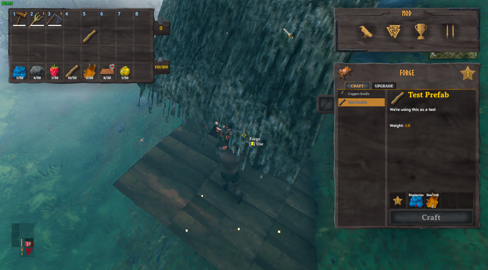

# DEPRECATED
# Registering custom recipes
_Recipes_ in Valheim are anything that the player is able to hold in their inventory.  
Creation of custom recipes is done through the `[ObjectManager](xref:JotunnLib.Managers.ObjectManager)` singleton class.

All recipes will always be loaded **after** all items. However, recipes will be loaded in the order that you call the `RegisterRecipe` function.

**Note:** You **must** only use names of existing prefabs (either ones you created or default Valheim ones). This can be prefabs that have already been registered by another mod, or that already exist in the game.

## Example
To create a new recipe, you must first add a handler for the `[ObjectRegister](xref:JotunnLib.Managers.ObjectManager.ObjectRegister)` event

```cs
private void Awake()
{
    ObjectManager.Instance.ObjectRegister += initObjects;
}
```

then, create the handler. You can register custom items and recipes from this handler. To register custom items, you must either pass a `[RecipeConfig](xref:JotunnLib.Entities.RecipeConfig)` instance to the function, or a Valheim `Recipe` object. The following example demonstrates how to use the `[RecipeConfig](xref:JotunnLib.Entities.RecipeConfig)`, as it is easier and less verbose.

```cs
private void initObjects(object sender, EventArgs e)
{
    // Recipes
    ObjectManager.Instance.RegisterRecipe(new RecipeConfig()
    {
        // Name of the recipe (defaults to "Recipe_YourItem")
        Name = "Recipe_TestPrefab",

        // Name of the prefab for the crafted item
        Item = "TestPrefab",

        // Name of the prefab for the crafting station we wish to use
        // Can set this to null or leave out if you want your recipe to be craftable in your inventory
        CraftingStation = "forge",

        // List of requirements to craft your item
        Requirements = new PieceRequirementConfig[]
        {
            new PieceRequirementConfig()
            {
                // Prefab name of requirement
                Item = "Blueberries",

                // Amount required
                Amount = 2
            },
            new PieceRequirementConfig()
            {
                // Prefab name of requirement
                Item = "DeerHide",

                // Amount required
                Amount = 1
            }
        }
    });
}
```

That's it! Now, we can visit a forge with some blueberries and deer hide in our inventory, and we can craft our item!




## EvilSword recipe


```cs
private static void recipeEvilSword(ItemDrop itemDrop)
{
    Recipe recipe = ScriptableObject.CreateInstance<Recipe>();
    recipe.name = "Recipe_EvilSword";
    recipe.m_item = itemDrop;
    recipe.m_craftingStation = PrefabManager.Cache.GetPrefab<CraftingStation>("piece_workbench");
    recipe.m_resources = new Piece.Requirement[]
    {
            new Piece.Requirement()
            {
                m_resItem = PrefabManager.Cache.GetPrefab<ItemDrop>("Stone"),
                m_amount = 1
            },
            new Piece.Requirement()
            {
                m_resItem = PrefabManager.Cache.GetPrefab<ItemDrop>("CustomWood"),
                m_amount = 1
            }
    };
    CustomRecipe CR = new CustomRecipe(recipe, false, false);
    ItemManager.Instance.AddRecipe(CR);
}
```

