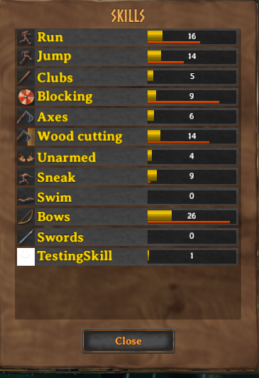

# Custom Skills
This example requires [assets](assets.md) to be loaded.


# Registering custom skills
Creation of custom skills is done through the [SkillManager](xref:JotunnLib.Managers.SkillManager) singleton.
This will automatically take care of incrementing the skill's SkillType (unique numerical ID), so there will be no conflicts between skills added by various mods.

## Example
To create a new skill, you must call the AddSkill function.

This should be called from within your mod's `Awake` method, and it will return a randomly generated SkillType for your new skill.
```cs
void addSkills()
{
    // Test adding a skill with a texture
    Sprite testSkillSprite = Sprite.Create(testTex, new Rect(0f, 0f, testTex.width, testTex.height), Vector2.zero);
    TestSkillType = SkillManager.Instance.AddSkill(new SkillConfig
    {
        Identifier = "com.jotunnlib.JotunnModExample.testskill",
        Name = "TestingSkill",
        Description = "A nice testing skill!",
        Icon = testSkillSprite,
        IncreaseStep = 1f
    });
    //if(!TestSkillType) Logger.
}
```

Then inside of `Update()` we will raise our skill level on keypress:
```cs
private void Update()
{
    if (Input.GetKeyDown(KeyCode.F8))
    { // Set a breakpoint here to break on F6 key press
        Player.m_localPlayer.RaiseSkill(TestSkillType, 1);
    }
}
```

_Note: Unless you actually have any levels in your skill, it won't show up in the skils menu. You must first raise your skill (either using a command, or actually implementing a way to earn levels) in order to be able to see it_

This is what it should look like in game:

