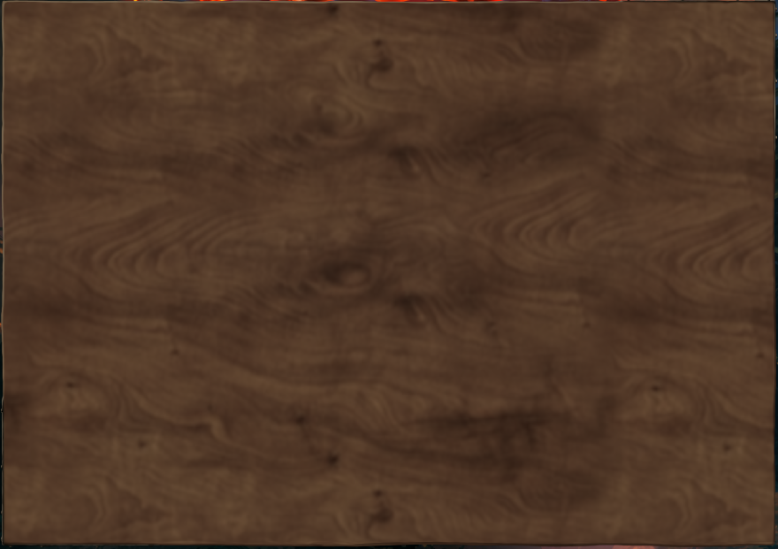

# GUI

To add custom GUI elements to the game it is necessary to add the prefabs or generate the GUI components in code respecting the [Unity UI guidelines](https://docs.unity3d.com/Packages/com.unity.ugui@1.0/manual/index.html).

## GUI event and PixelFix

Valheim creates new clones of the whole menu and ingame GUI everytime the scene changes from start to main and vice verse. So if you dont want to create and draw on your own canvas, you have to add your custom stuff to the right path on every scene change, too. Additionally, Valheim implemented a scaling feature for high resolution display (4K output or high DPI screens) called the PixelFix. Both concepts can be accessed easily via shortcuts through Jötunn. You can subscribe to the event [GUIManager.OnPixelFixCreated](xref:Jotunn.Managers.GUIManager.OnPixelFixCreated) which gets called everytime the scene changed and Jötunn has created and resolved the current PixelFix path in the scene. In that event call you can load / create your custom GUI components and add them in the transform hierarchy of the [GUIManager.PixelFix](xref:Jotunn.Managers.GUIManager.PixelFix) GameObject.

## Determine a headless instance

A dedicated server running without GUI is commonly referred to as a headless server. Valheim provides methods in ZNet to determine if the current instance is a dedicated server, a "local" server (aka local game that others can connect to) or a client to another server. Jötunn also provides shortcuts to these via [ZNetExtension](xref:Jotunn.ZNetExtension). Problem is that both approaches require ZNet to be instantiated which is not the case on your mods Awake(). If you need that information early on, the GUIManager provides a method for that: [GUIManager.IsHeadless()](xref:Jotunn.Managers.GUIManager.IsHeadless) returns true if the current game instance is a dedicated/headless server without relying on ZNet. Jötunn also does not register GUI or Input hooks in that case to save on unnecessarily allocated resources.

## Valheim style GUI elements

The [GUIManager](xref:Jotunn.Managers.GUIManager) provides useful methods to create buttons, text element and more at runtime using the original Valheim assets to create a seamless look for your custom GUI components.

### Wood panels



Woodpanels, nicely usable as containers for other gui elements.

Example:
```cs
var panel = GUIManager.Instance.CreateWoodpanel(GUIManager.PixelFix.transform, new Vector2(0.5f, 0.5f), new Vector2(0.5f, 0.5f), new Vector2(0f, 0f), 400f, 300f);
```

### Buttons


To create buttons, provide text, the parent's transform, min and max anchors, the position and it's size (width and height).

Example:
```cs
var button = GUIManager.Instance.CreateButton("A Test Button", testPanel.transform, new Vector2(0.5f, 0.5f), new Vector2(0.5f, 0.5f), new Vector2(0, 0), 250, 100);
```

### Text elements


Example:
```cs
var text = GUIManager.Instance.CreateText("JötunnLib, the Valheim Lib", GUIManager.PixelFix.transform,new Vector2(0.5f, 0.5f), new Vector2(0.5f, 0.5f),
    new Vector2(0f, 0f), GUIManager.Instance.AveriaSerifBold, 18, GUIManager.Instance.ValheimOrange, true, Color.black, 400f, 30f, false);
```

### Checkboxes


Example:
```cs
var checkbox = GUIManager.Instance.CreateToggle(GUIManager.PixelFix.transform, new Vector2(0f, 0f), f, 40f);
```

### Getting sprites

Gets sprites from the textureatlas by name. You find a list of the sprite names [here](../data/gui/sprite-list.md).

```cs
var sprite = GUIManager.Instance.GetSprite("text_field");
```

### Instance properties

The [GUIManager](xref:Jotunn.Managers.GUIManager) also comes with some useful instance properties for your custom assets to resemble the vanilla Valheim style.

- Font AveriaSerif
- Font AveriaSerifBold (the default Valheim font)
- Color ValheimOrange

