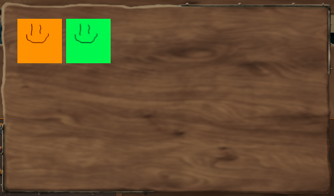

# Item Variants

An _item variant_ in Valheim is an item which can be crafted with varying textures on the same item/model. Adding of custom item variants is achieved through JVLs [ItemConfig](xref:Jotunn.Configs.ItemConfig). The process involves adding a texture atlas to a material and is much easier done in Unity on custom prefabs rather than in code. So this feature currently only makes sense if you want to copy existing prefabs and add own variations to them.

## Create a wooden shield with custom variants

In this example, we will clone a vanilla shield with custom variants which the user may equip. In order to do this, we will need to reference already instantiated game assets. One method of doing so is by using the event provided by Jötunn. The event is fired when the vanilla items are in memory and thus clonable (more precisely in the start scene before the initial ObjectDB is cloned).

```cs
private voic Awake()
{
    PrefabManager.OnVanillaPrefabsAvailable += AddVariants;
}
```

Inside the method we load two different sprites for the variant icons and a sprite atlas texture using Jötunn's [AssetUtils](xref:Jotunn.Utils.AssetUtils). Using the [ItemConfig's](xref:Jotunn.Configs.ItemConfig) properties `Icons` and `StyleTex`, we tell Jötunn that this item has two variants (variant count always equals the icon array size) and to use the texture provided as the texture atlas for the two variants.

```cs
// Clone the wooden shield and add own variations to it
private void AddVariants()
{
    try
    {
        Sprite var1 = AssetUtils.LoadSpriteFromFile("JotunnModExample/Assets/test_var1.png");
        Sprite var2 = AssetUtils.LoadSpriteFromFile("JotunnModExample/Assets/test_var2.png");
        Texture2D styleTex = AssetUtils.LoadTexture("JotunnModExample/Assets/test_varpaint.png");
        CustomItem CI = new CustomItem("item_lulvariants", "ShieldWood", new ItemConfig
        {
            Name = "$lulz_shield",
            Description = "$lulz_shield_desc",
            Requirements = new RequirementConfig[]
            {
                new RequirementConfig{ Item = "Wood", Amount = 1 }
            },
            Icons = new Sprite[]
            {
                var1, var2
            },
            StyleTex = styleTex
        });
        ItemManager.Instance.AddItem(CI);
    }
    catch (Exception ex)
    {
        Jotunn.Logger.LogError($"Error while adding variant item: {ex}");
    }
    finally
    {
        // You want that to run only once, Jotunn has the item cached for the game session
        PrefabManager.OnVanillaPrefabsAvailable -= AddVariants;
    }
}
```

As a result we can build a new shield with our custom variants, indicated by the "Style" button on the crafting menu. 
<br />


After clicking the style button, we can choose between our two variants.
<br />


Each variation gets its own texture applied to the material.
<br />


## Creating custom assets with variants in Unity

TBD