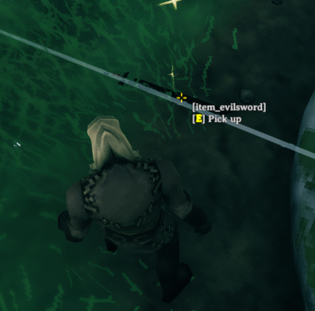
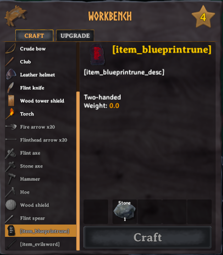

# Items

_Items_ can be equipment, resources, or building pieces. In this tutorial you will learn how to set up custom items within the game, either based upon existing assets, or through the creation of entirely custom assets.

This example requires [assets](asset-loading.md) to be loaded. The code snippets are taken from our [example mod](https://github.com/Valheim-Modding/JotunnModExample).

> [!NOTE]
> You **must** only use names of existing prefabs. This can be prefabs you created, that have already been registered by another mod, or that already exist in the game.

## Cloning existing prefabs

In this example, we will clone a resource and a weapon which the user may equip. In order to do this, we will need to reference already instantiated game assets. One method of doing so is by using the event provided by Jötunn. The event is fired when the vanilla items are in memory and thus clonable (more precisely in the start scene before the initial ObjectDB is cloned).

```cs
private voic Awake()
{
    ItemManager.OnVanillaItemsAvailable += AddClonedItems;
}
```

First we use the [CustomItem](xref:Jotunn.Entities.CustomItem) constructor to define the name of our item, and the existing prefab name which it should be cloned from. The item can be immediately added via the [AddItem](xref:Jotunn.Managers.ItemManager.AddItem(Jotunn.Entities.CustomItem)) method, and then modified to make our clone a little bit more unique.

```cs
// Implementation of cloned items
private void AddClonedItems()
{
    try
    {
        // Create and add a custom item based on SwordBlackmetal
        CustomItem CI = new CustomItem("EvilSword", "SwordBlackmetal");
        ItemManager.Instance.AddItem(CI);

        // Replace vanilla properties of the custom item
        var itemDrop = CI.ItemDrop;
        itemDrop.m_itemData.m_shared.m_name = "$item_evilsword";
        itemDrop.m_itemData.m_shared.m_description = "$item_evilsword_desc";

        // Create the recipe for the sword
        RecipeEvilSword(itemDrop);

        // Show a different KeyHint for the sword.
        KeyHintsEvilSword();
    }
    catch (Exception ex)
    {
        Jotunn.Logger.LogError($"Error while adding cloned item: {ex.Message}");
    }
    finally
    {
        // You want that to run only once, Jotunn has the item cached for the game session
        ItemManager.OnVanillaItemsAvailable -= AddClonedItems;
    }
}
```

If we load up the game, type `devcommands` into the console (F5), and `spawn EvilSword` we can now see that we have a new item available to us:

 

As you may notice, our item does not hold the display text we might prefer. In order to resolve this you can read our [localization](localization.md) tutorial.

To be able to craft the item on a workbench, a `Recipe` must be created. This is done in the `RecipeEvilSword()` method. Refer to our [recipe tutorial](recipes.md#adding-a-recipe-using-valheim-recipe--prefab-cache) to learn about recipe creation.

There is also a custom key hint added in the `KeyHintEvilSword()` method. To learn about the custom key hints, refer to our [input tutorial](inputs.md#custom-keyhints).

## Instantiating items from prefabs

In the previous examples we saw that its possible to easily clone existing items and customise our recipe's required for the items, however these examples are rather verbose, and requires a fair amount of setup. In order to better facilitate configurations such as these, we have introduced the [ItemConfig](xref:Jotunn.Configs.ItemConfig) abstraction, which exposes common properties such as the ItemDrop, CraftingStation, and needed Resources via [RequirementConfig's](xref:Jotunn.Configs.RequirementConfig).

Similarly in this example instead of cloning our prefabs, we are just going to import a custom prefab directly from an asset bundle (for more information about asset loading see our [asset loading tutorial](asset-loading.md)). Using the `*Config` classes we create the [CustomItem](xref:Jotunn.Entities.CustomItem) and the corresponding recipe in one call and finally add it to the ItemManager.

```cs
// Implementation of items and recipes via configs
private void CreateBlueprintRune()
{
    // Create and add a custom item
    var rune_prefab = blueprintRuneBundle.LoadAsset<GameObject>("BlueprintTestRune");
    var rune = new CustomItem(rune_prefab, fixReference: false,
        new ItemConfig
        {
            Amount = 1,
            Requirements = new[]
            {
                new RequirementConfig
                {
                    Item = "Stone",
                    //Amount = 1,           // These are all the defaults, so no need to specify
                    //AmountPerLevel = 0,
                    //Recover = false 
                }
            }
        });
    ItemManager.Instance.AddItem(rune);
}
```

 

As in the example before, our item does not hold the display text we might prefer. In order to resolve this you can read our [localization](localization.md) tutorial.

We have now added two custom items, both of which can be equipped, as well as a custom resource which is used to create items. This concludes the items tutorial. [Go back to the index](overview.md).