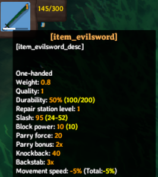
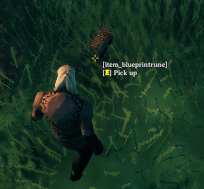

# Items
Valheim items can be equipment, resources, or building pieces. In this tutorial you will learn how to set up custom items within the game, either based upon existing assets, or through the creation of entirely custom assets.

**Note**: This example requires [assets](asset-loading.md) to be loaded, as well as [localizations](localization.md).

## Cloning existing prefabs

In this example, we will clone a resource and a weapon which the use may equip. In order to do this, we will need to reference already instantiated game assets. One method of doing so is by using the event provided by Jotunn, the event is fired when the vanilla items are in memory and thus clonable :

```cs
private voic Awake()
{
    ItemManager.OnVanillaItemsAvailable += AddClonedItems;
}
```

First we use the [CustomItem](xref:Jotunn.Entities.CustomItem) constructor to define the name of our item, and the existing prefab name which it should be cloned from. The item can be immediately added via the [AddItem](xref:Jotunn.Managers.ItemManager.AddItem(Jotunn.Entities.CustomItem)) method, and then modified to make our clone a little bit more unique.
```cs
private void AddClonedItems()
{
    // Create and add a custom item based on SwordBlackmetal
    CustomItem CI = new CustomItem("EvilSword", "SwordBlackmetal");
    ItemManager.Instance.AddItem(CI);

    // Replace vanilla properties of the custom item
    var itemDrop = CI.ItemDrop;
    itemDrop.m_itemData.m_shared.m_name = "$item_evilsword";
    itemDrop.m_itemData.m_shared.m_description = "$item_evilsword_desc";

    // Create and add a recipe for the copied item
    recipeEvilSword(itemDrop);

    // You want that to run only once, Jotunn has the item cached for the game session
    ItemManager.OnVanillaItemsAvailable -= AddClonedItems;
}
```

If we load up the game, type `devcommands` into the console(F5), and `spawn EvilSword` we can now see that we have a new item available to us:

 
  

As you may notice, our item does not hold the display text we might prefer. In order to resolve this you can read our [localization](localization.md) tutorial.

### Item Recipe's
In this example, we create a method named recipeEvilSword which adds a new crafting bench recipe for our custom item. In particular, this recipe includes a custom resource. We will use the native `Recipe` object and instantiate a new instance, and then define some basic properties of the recipe, such as the item which it produces, the piece where it can be crafted, and the resources required to craft the product. You will notice that before we add our native recipe that we wrap it inside of a [CustomRecipe](xref:Jotunn.Entities.CustomRecipe). This wrapper is mostly to facilitate Jötunn's FixReferences for prefabs which include [mock references](asset-mocking.md) but does not really have any affect for this specific scenario. Notice both fixRef params are set to false, this is because we will use the [PrefabManager's](xref:Jotunn.Managers.PrefabManager.GetPrefab(System.String)) cache to acquire a reference to native assets such as the crafting bench, and required resources to define the recipe's conditions.

```cs
private static void RecipeEvilSword(ItemDrop itemDrop)
{
    // Create and add a recipe for the copied item
    Recipe recipe = ScriptableObject.CreateInstance<Recipe>();
    recipe.name = "Recipe_EvilSword";
    recipe.m_item = itemDrop;
    recipe.m_craftingStation = PrefabManager.Cache.GetPrefab<CraftingStation>("piece_workbench");
    recipe.m_resources = new Piece.Requirement[]
    {
            new Piece.Requirement()
            {
                m_resItem = PrefabManager.Cache.GetPrefab<ItemDrop>("Stone"),
                m_amount = 1
            },
            new Piece.Requirement()
            {
                m_resItem = PrefabManager.Cache.GetPrefab<ItemDrop>("CustomWood"),
                m_amount = 1
            }
    };

    // Since we got the prefabs from the cache, no referencing is needed
    CustomRecipe CR = new CustomRecipe(recipe, fixReference: false, fixRequirementReferences: false);
    ItemManager.Instance.AddRecipe(CR);
}
```

## Instantiating items from prefabs

In the previous examples we saw that its possible to easily clone existing items and customise our recipe's required for the items, however these examples are rather verbose, and requires a fair amount of setup. In order to better facilitate configurations such as these, we have introduced `*Config` abstractions such as the [RecipeConfig](xref:Jotunn.Configs.RecipeConfig) and [RequirementConfig](xref:Jotunn.Configs.RequirementConfig), which exposes common properties such as the ItemDrop, CraftingStation, and Resources.

Similarly in this example instead of cloning our prefabs, we are just going to import a custom prefab directly from an asset bundle, which is exceedingly convenient using Jötunn's asset loading helpers:

```cs
private void CreateBlueprintRune()
{
    // Create and add a custom item
    // CustomItem can be instantiated with an AssetBundle and will load the prefab from there
    CustomItem rune = new CustomItem(BlueprintRuneBundle, "BlueprintRune", false);
    ItemManager.Instance.AddItem(rune);

    // Create and add a recipe for the custom item
    CustomRecipe runeRecipe = new CustomRecipe(new RecipeConfig()
    {
        Item = "BlueprintRune",
        Amount = 1,
        Requirements = new RequirementConfig[]
        {
            new RequirementConfig {Item = "Stone", Amount = 1}
        }
    });
    ItemManager.Instance.AddRecipe(runeRecipe);
}
```

 

We have now added two custom items, both of which can be equipped, as well as a custom resource which is used to create items. This concludes the items tutorial. [Go back to the index](overview.md).