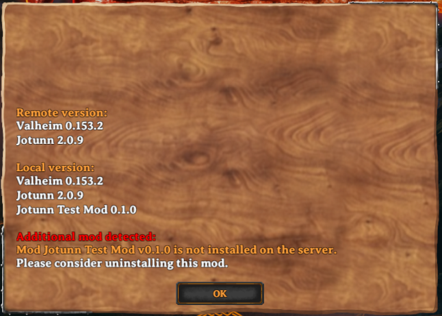
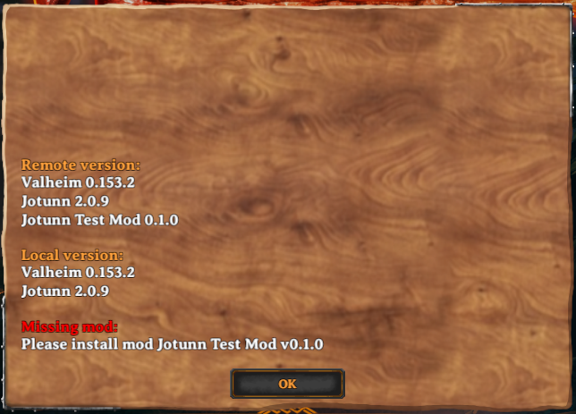
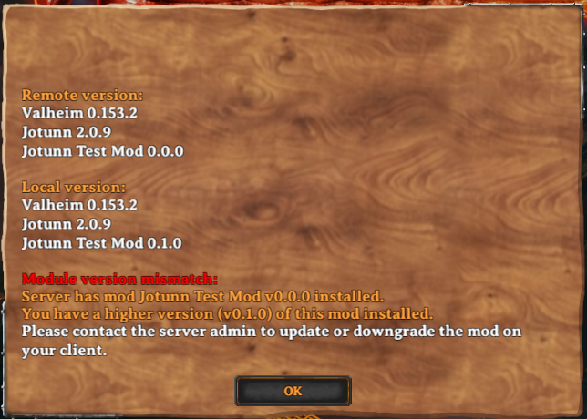

# NetworkCompatibility

[NetworkCompatibility](xref:Jotunn.Utils.NetworkCompatibilityAttribute) is an attribute developers can attach to their `BaseUnityPlugin` which will allow them to specify and configure the specific network requirements their plugin requires to maintain client<->client interoperability, consistency, and synchronisation. One example of this may be a mod which uses a custom asset. While one client may be able to create, use, and interact with the object in the environment, if no other clients have the asset mod then they will experience a difference in gameplay from the client with the asset.

In order to quote _"enforce"_ network compatibility, a version check is initiated when the client connects to the server, where each client will compare their plugins, and the requirements specified by each, and the server will decide depending on the requirements of each plugin, if the client is permissible. If there is a version mismatch, the client will be disconnected with a version mismatch error, that details the pluginGUID'd and the offending version string, and the requirement. The client may then satisfy the requirements and reconnect successfully.

## NetworkCompatibility Attribute
The [NetworkCompatibility attribute](xref:Jotunn.Utils.NetworkCompatibilityAttribute) provides two parameters, one for [CompatibilityLevel](xref:Jotunn.Utils.CompatibilityLevel) (should Jötunn ensure that your mod is loaded on server and clients), and one for [VersionStrictness](xref:Jotunn.Utils.VersionStrictness) (should Jötunn ensure that specific versions of your mod are loaded). This attribute must be defined on your mods main class (the one which inherits from BaseUnityPlugin) to use the feature. If nothing is defined your mod is treated as it had the compatibility level of `NotEnforced`.

Example:
```cs
[NetworkCompatibility(CompatibilityLevel.EveryoneMustHaveMod, VersionStrictness.Minor)]
internal class TestMod : BaseUnityPlugin
{
  ...
}
```

## Compatibility Level

The compatibility levels define if your mod has to be loaded on both sides and if your mod's version must be checked by Jötunn.

**NotEnforced:** The compatibility check ignores if the mod is installed or not and also does not check the version at all. VersionStrictness value is ignored.

**VersionCheckOnly:** The compatibility check ignores the mod if it is not installed on both sides. If it is installed on both sides the version is checked according to the VersionStrictness value.

**EveryoneMustHaveMod:** It is checked if the mod is installed and if the version matches the requirements of the VersionStrictness value.

**ClientMustHaveMod:** If the mod is installed on the server, every client must have it, too. VersionStrictness does apply when installed on both sides.

**ServerMustHaveMod:** If the mod is installed on the client, the server must have it, too. VersionStrictness does apply when installed on both sides.

## Version Strictness

Version strictness defines at which level according to the [Semantic Versioning scheme](#semantic-versioning-and-networkcompatibility) the mod's version must be equal to be allowed to connect.

## Example

Lets take a look at how this interacts over two devices, a dedicated server and a client. In all examples the compatibility level is `EveryoneMustHaveMod` and the versions strictness is `Minor`.

**Clientside NetworkCompatibility plugin, none server**: Client Version mismatch from additional plugin:<br>

**Clientside none, NetworkCompatibilityPlugin server**: Server version mismatch from additional plugin:<br>

**VersionStrictness unequal, client>server**: server version mismatch from major, minor, patch:<br>

**VersionStrictness unequal, server>client**: client version mismatch from major, minor, patch:<br>

## Semantic versioning and NetworkCompatibility

[Semantic Versioning](https://semver.org/) is the process of assigning versions to states in the form of `Major.Minor.Patch`. In general, bug fixes are usually placed within the patch version, feature additions are placed within the minor version, and breaking changes are placed within the major version.

**Major**:
When applying this to network compatibility module, the "safe"/normal use case is to enforce minor version strictness. One use case for this may be for instance an asset/item mod, which introduces new items every minor version. In this case it is important to maintain minor version strictness to ensure network sync of item assets with the server and other clients.

**Minor**:
Another use case might be an overhaul which tweaks many different settings and client inputs/UX/interactions, and for the most part although minor features are frequently pushed, they do not require version synchronisation on such a granular level. In this scenario, the developer might opt for major version strictness.

**Patch**:
Generally, it is not advised to enforce version strictness on patches, however we do not dictate how developers control their versioning, and as thus we expose this version for network compatibility should the developer only choose to increment patches.


Some examples which **need** version synchronicity with the server and other clients:

- Newly introduced RPCs (client or server wouldn't know what to do with them)
- Changed RPCs (for example data format changes) which could either break server or client execution
- New and removed items
- Changed items (for example newly added upgrades)

If your mod does any of the above we encourage you to set the NetworkCompatibility attribute to `EveryoneMustHaveMod` and the version strictness accordingly.
Our suggestion is to set it to `Minor` which still gives you the flexibility to add unrelated changes without needing the server or clients to upgrade.

But whatever strictness you choose, you need to increase your version accordingly to make sure clients and servers can work together.
