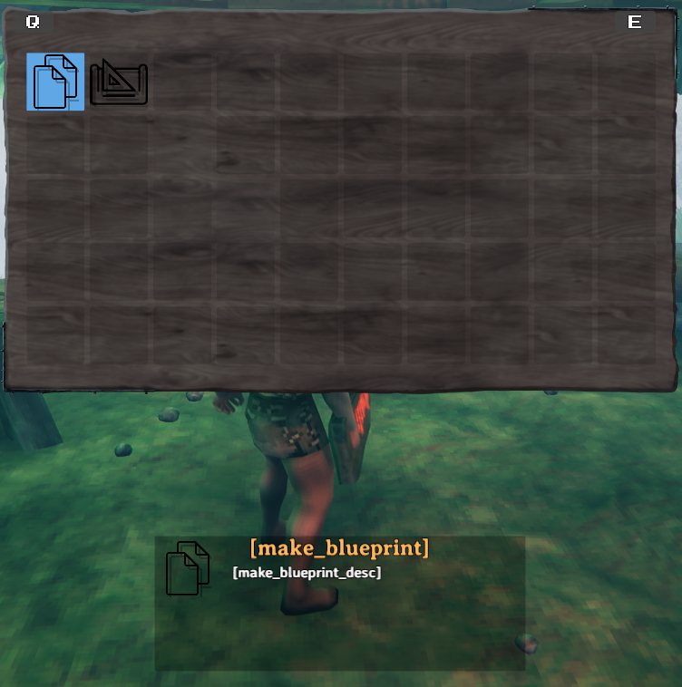
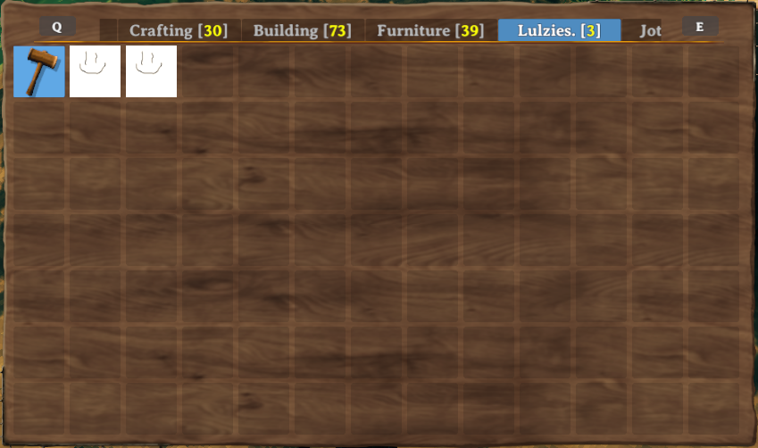
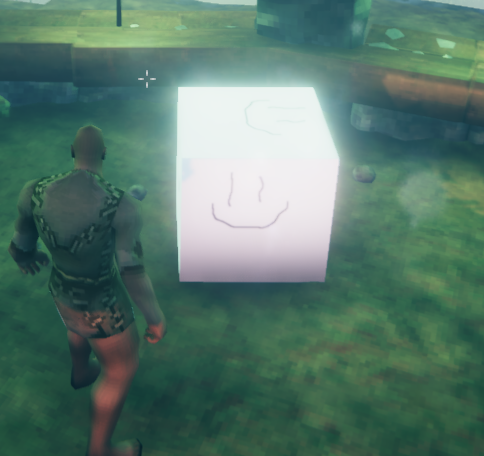
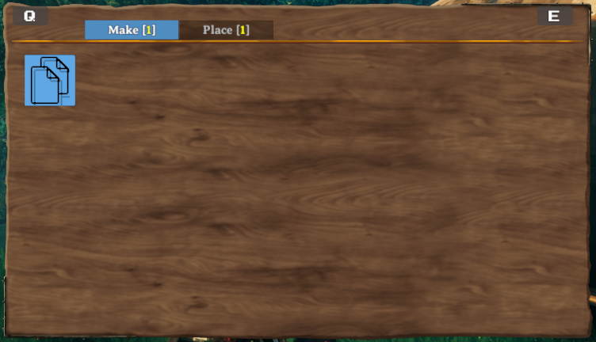

# Pieces and PieceTables

##### Note: _This example requires [assets](asset-loading.md) to be loaded, as well as [localizations](localization.md)._

## Pieces
_Pieces_ in Valheim are anything that can be built in the game, through means such as the Hammer, Cultivator, Hoe or your own custom tool items. This includes things such as plant sapplings, the workbench, and walls. Custom pieces are handled by the [PieceManager](xref:Jotunn.Managers.PieceManager) singleton.  

**Note:** You **must** only use names of existing prefabs (either ones you created or default Valheim ones). This can be prefabs that have already been registered by another mod, or that already exist in the game.  

In order for a prefab to be a _piece_, it must have the `Piece` component attached to the prefab.

## Piece Tables
_Piece Tables_ in Valheim are connecting the buildable pieces to the tools used for building. They also define the build categories and if a tool can remove pieces again. In vanilla Valheim you only can use four building categories or none on a piece table. Jötunn adds the ability to use custom categories on vanilla tools or completely own categories on custom tool items.

## Example using a custom item and prefabs

The `Blueprint Rune`, a custom item one of our developers has been working on, is intended to duplicate existing structures. In order to keep this example simple, we are not including this functionality, but are utilising these assets to provide an example of loading pieces via prefabs, so please bear in mind that while the code below is perfectly functional, there is no mesh/model associated with the following pieces due to the nature of their intended function.

### Custom item

Loading the `Blueprint Rune` item is covered in the [items tutorial](items.md). Refer to this if you want to learn how to add your custom tool item first and return to this tutorial afterwards.

### Custom piece table

After loading our custom item, we will load a piece table GameObject from our example asset bundle, create a [CustomPieceTable](xref:Jotunn.Entities.CustomPieceTable) from it and add it to the [PieceManager](xref:Jotunn.Managers.PieceManager).

```cs
private void CreateRunePieceTable()
{
    GameObject tablePrefab = blueprintRuneBundle.LoadAsset<GameObject>("_BlueprintTestTable");
    CustomPieceTable CPT = new CustomPieceTable(tablePrefab);
    PieceManager.Instance.AddPieceTable(CPT);
}
```

### Custom pieces using PieceConfigs

Now we will load two new pieces into the previously created blueprint piecetable. In order to better facilitate creation of pieces we have introduced the abstractions of [PieceConfig's](xref:Jotunn.Configs.PieceConfig) and [RequirementConfig](xref:Jotunn.Configs.RequirementConfig). These allow us to quickly and easily define common properties for pieces, such as the table they belong too, any restrictions or resources required.

```cs
private void CreateRunePieces()
{
    // Create and add a custom piece for the rune. Add the prefab name of the PieceTable to the config.
    var makebp_prefab = blueprintRuneBundle.LoadAsset<GameObject>("make_testblueprint");
    var makebp = new CustomPiece(makebp_prefab,
        new PieceConfig
        {
            PieceTable = "_BlueprintTestTable"
        });
    PieceManager.Instance.AddPiece(makebp);

    // Load, create and add another custom piece for the rune. This piece uses more properties
    // of the PieceConfig - it can now be build in dungeons and has actual requirements to build it.
    var placebp_prefab = blueprintRuneBundle.LoadAsset<GameObject>("piece_testblueprint");
    var placebp = new CustomPiece(placebp_prefab,
        new PieceConfig
        {
            PieceTable = "_BlueprintTestTable",
            AllowedInDungeons = true,
            Requirements = new[]
            {
                new RequirementConfig
                {
                    Item = "Wood",
                    Amount = 2,
                    //AmountPerLevel = 0,   // Amount is changed, all other Properties are left at default
                    //Recover = false 
                }
            }
        });
    PieceManager.Instance.AddPiece(placebp);

    // Also add localizations for the rune 
    BlueprintRuneLocalizations();
}
```

And here we have our final results:<br />


As you can see in the screenshot the name and description are not yet localized. This is done via the `BlueprintRuneLocalizations()` method. To read more about localization/translation head over to the [localization tutorial pages](localization.md).

## Example adding custom table categories on vanilla tables

With [PieceConfig's](xref:Jotunn.Configs.PieceConfig) it is possible to add your pieces to a vanilla or even custom piece table category. For this example we create "empty" pieces (GameObjects with just a cube model and a Piece component) and add them to a new category "Lulzies" on the Hammer.

```cs
// Implementation of custom pieces from an "empty" prefab with new piece categories
private void AddPieceCategories()
{
    // Create a new CustomPiece as an "empty" GameObject. Also set addZNetView to true 
    // so it will be saved and shared with all clients of a server.
    CustomPiece CP = new CustomPiece("piece_lul", addZNetView: true, new PieceConfig
    {
        Name = "$piece_lul",
        Description = "$piece_lul_description",
        Icon = testSprite,
        PieceTable = "Hammer",
        ExtendStation = "piece_workbench", // Makes this piece a station extension
        Category = "Lulzies"  // Adds a custom category for the Hammer
    });

    if (CP != null)
    {
        // Add our test texture to the Unity MeshRenderer
        var prefab = CP.PiecePrefab;
        prefab.GetComponent<MeshRenderer>().material.mainTexture = testTex;

        PieceManager.Instance.AddPiece(CP);
    }

    // Create another "empty" custom piece
    CP = new CustomPiece("piece_lel", addZNetView: true, new PieceConfig
    {
        Name = "$piece_lel",
        Description = "$piece_lel_description",
        Icon = testSprite,
        PieceTable = "Hammer",
        ExtendStation = "piece_workbench", // Makes this piece a station extension
        Category = "Lulzies"  // Adds a custom category for the Hammer
    });

    if (CP != null)
    {
        // Add our test texture to the Unity MeshRenderer and make the material color grey
        var prefab = CP.PiecePrefab;
        prefab.GetComponent<MeshRenderer>().material.mainTexture = testTex;
        prefab.GetComponent<MeshRenderer>().material.color = Color.grey;

        PieceManager.Instance.AddPiece(CP);
    }
}
```

The result is a new category added to the piece table of the Hammer:<br />

<br />
One of the pieces placed in the world:<br />


## Example creating completely new categories using PieceTableConfigs

While adding pieces with custom categories to existing piece tables (such as the Hammer), you can also create custom items with piece tables using only custom categories. For that you will need to use [PieceTableConfig's](xref:Jotunn.Configs.PieceTableConfig) when creating a [CustomPieceTable](xref:Jotunn.Entities.CustomPieceTable). This example is not used in our example mod but in our TestMod for Jötunn. Keep that in mind as you will not find the code in the example mod. We are still using the piece table of the example `Blueprint Rune` but this time add the custom pieces to own categories.

```cs
private void AddItemsWithConfigs()
{
    // Add a custom piece table with custom categories
    var table_prefab = blueprintRuneBundle.LoadAsset<GameObject>("_BlueprintTestTable");
    CustomPieceTable rune_table = new CustomPieceTable(table_prefab,
        new PieceTableConfig
        {
            CanRemovePieces = false,
            UseCategories = false,
            UseCustomCategories = true,
            CustomCategories = new string[]
            {
                "Make", "Place"
            }
        }
    );
    PieceManager.Instance.AddPieceTable(rune_table);

    // Create and add a custom item
    var rune_prefab = blueprintRuneBundle.LoadAsset<GameObject>("BlueprintTestRune");
    var rune = new CustomItem(rune_prefab, fixReference: false,  // Prefab did not use mocked refs so no need to fix them
        new ItemConfig
        {
            Amount = 1,
            Requirements = new[]
            {
                new RequirementConfig { Item = "Stone", Amount = 1 }
            }
        });
    ItemManager.Instance.AddItem(rune);

    // Create and add custom pieces
    var makebp_prefab = blueprintRuneBundle.LoadAsset<GameObject>("make_testblueprint");
    var makebp = new CustomPiece(makebp_prefab,
        new PieceConfig
        {
            PieceTable = "_BlueprintTestTable",
            Category = "Make"
        });
    PieceManager.Instance.AddPiece(makebp);

    var placebp_prefab = blueprintRuneBundle.LoadAsset<GameObject>("piece_testblueprint");
    var placebp = new CustomPiece(placebp_prefab,
        new PieceConfig
        {
            PieceTable = "_BlueprintTestTable",
            Category = "Place",
            AllowedInDungeons = true,
            Requirements = new[]
            {
                new RequirementConfig { Item = "Wood", Amount = 2 }
            }
        });
    PieceManager.Instance.AddPiece(placebp);
}
```

The result is a tool with two completely custom categories:<br />
