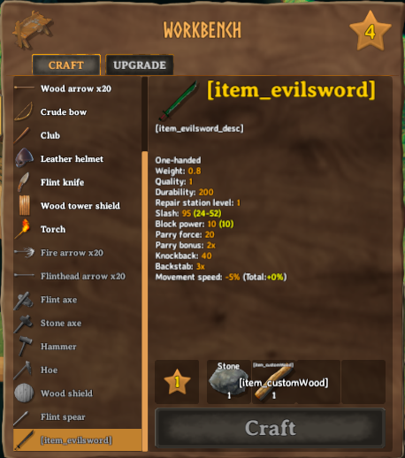

# Custom Recipes
_Recipes_ in Valheim are coupling the items a player can craft to the various crafting stations. They also define if and at which cost items can be upgraded as well as the crafting station which can repair items. Creation of custom recipes is done through the [ItemManager](xref:Jotunn.Managers.ItemManager) singleton class.

All recipes will always be loaded **after** all items. However, recipes will be loaded in the order that you call the `AddRecipe` function.

You have three options for adding custom recipes in Jötunn:
- Use a [RecipeConfig](xref:Jotunn.Configs.RecipeConfig) where you can define the ingame objects your recipe should reference via strings of the object names.
- Use a JSON file to define an array of [RecipeConfig](xref:Jotunn.Configs.RecipeConfig) objects, then load them when your mod starts.
- Create the `Recipe` ScriptableObject on your own. If the game has already loaded it's own assets, you can reference the objects in the recipe via Jötunns [Prefab Cache](xref:Jotunn.Managers.PrefabManager.Cache) or create [Mocks](asset-mocking.md) and let Jötunn fix the references at runtime.

These three approaches can be mixed and used as you please, as they will accomplish the same goal.

**Note:** You **must** only use names of existing prefabs (either ones you created or default Valheim ones). This can be prefabs that have already been registered by another mod, or that already exist in the game.

## Examples
This is what our finished product will look like in-game after using any of the following examples:



### Adding a recipe using RecipeConfig

When you are loading your mod assets before Valheim loads it's vanilla assets into the game (in your Mods `Awake()` for example) you need to use the [RecipeConfig](xref:Jotunn.Configs.RecipeConfig) class to create a custom recipe. You define the referenced prefabs via their names by string, instantiate a [CustomRecipe](xref:Jotunn.Entities.CustomRecipe) with that and let Jötunn resolve the correct references at runtime for you.

```cs
CustomRecipe runeRecipe = new CustomRecipe(new RecipeConfig()
{
    Item = "BlueprintRune",                 // name of the item prefab to be crafted
    CraftingStation = "piece_workbench"     // name of the crafting station prefab where the item can be crafted
    Requirements = new RequirementConfig[]  // resources and amount needed for it to be crafted
    {
        new RequirementConfig { Item = "Stone", Amount = 2 },  
        new RequirementConfig { Item = "Wood", Amount = 1 }
    }
});
ItemManager.Instance.AddRecipe(runeRecipe);
```

Please take a look at the actual implementation of [RecipeConfig](xref:Jotunn.Configs.RecipeConfig) for all properties you can set in the config.

### Adding a recipe using JSON
First, we must create a JSON file which will keep an array of all the recipes we wish to add. This JSON file should contain an array of [RecipeConfig](xref:Jotunn.Configs.RecipeConfig) objects (note, this _must_ be an array). This can be done like so:
```json
[
  {
    "Item": "Blueberries",
    "Amount": 1,
    "Requirements": [
      {
        "Item": "Stone",
        "Amount": 2
      },
      {
        "Item": "Wood",
         "Amount": 1
      }
    ]
  }
]
```
Please take a look at the actual implementation of [RecipeConfig](xref:Jotunn.Configs.RecipeConfig) for all properties you can set in the config.

Next, we need to tell Jötunn where our JSON file is. If the JSON file is not in an AssetBundle, we can load it like so:

```cs
private void Awake()
{
    // Load recipes from JSON file
    ItemManager.Instance.AddRecipesFromJson("TestMod/Assets/recipes.json");
}
```

### Adding a recipe using Valheim Recipe & Prefab Cache

The [JotunnModExample](https://github.com/Valheim-Modding/JotunnModExample) creates a cloned item "EvilSword" in the method `AddClonedItem()`. For the user to be able to craft the sword at the workbench we define a recipe as an actual Valheim Recipe class using the Prefab Cache of Jötunn and add it to the [ItemManager](xref:Jotunn.Managers.ItemManager) as a [CustomRecipe](xref:Jotunn.Entities.CustomRecipe) like this:

```cs
// Implementation of assets via using manual recipe creation and prefab cache's
private static void RecipeEvilSword(ItemDrop itemDrop)
{
    Recipe recipe = ScriptableObject.CreateInstance<Recipe>();
    recipe.name = "Recipe_EvilSword";
    recipe.m_item = itemDrop;
    recipe.m_craftingStation = PrefabManager.Cache.GetPrefab<CraftingStation>("piece_workbench");
    recipe.m_resources = new Piece.Requirement[]
    {
            new Piece.Requirement()
            {
                m_resItem = PrefabManager.Cache.GetPrefab<ItemDrop>("Stone"),
                m_amount = 1
            },
            new Piece.Requirement()
            {
                m_resItem = PrefabManager.Cache.GetPrefab<ItemDrop>("CustomWood"),
                m_amount = 1
            }
    };
    CustomRecipe CR = new CustomRecipe(recipe, false, false);
    ItemManager.Instance.AddRecipe(CR);
}
```