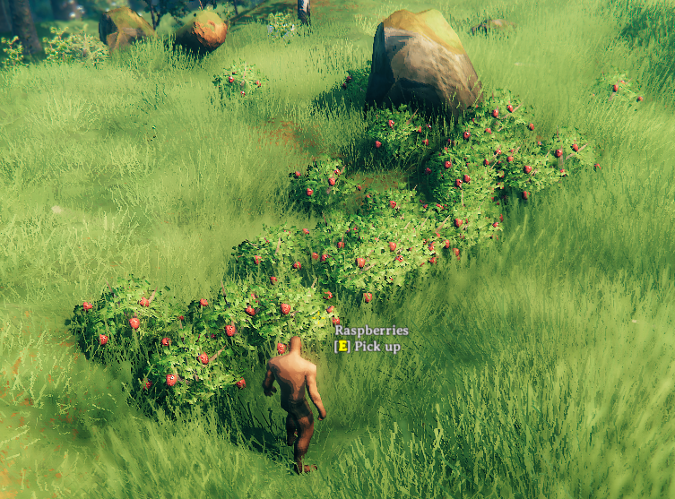
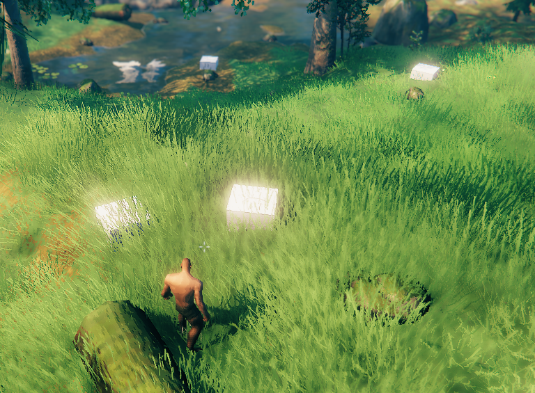

# Zones

The world of Valheim is split up into Zones, each 64 by 64 meters.

Locations and Vegetation are loaded during world load. Use the event `ZoneManager.OnVanillaLocationsAvailable` to get a callback when the locations are available for use.
This is called every time a world loads, so make sure to only add your custom locations & vegetations once.
Modifications to vanilla locations & vegetation must be repeated every time.

## Filters
Locations and Vegetation have many properties that are used to filter randomly sampled positions when placing. Check the XML docs on the fields of [LocationConfig](xref:Jotunn.Configs.LocationConfig) and [VegetationConfig](xref:Jotunn.Configs.VegetationConfig).

## Vegetation
Vegetation is placed for each Zone, so quantities are per zone. All possible vegetations are attempted to be placed for each zone, there is no limit to the total amount.

### Modifying existing vegetation
Modify existing Vegetation configuration to increase the group size:
```cs
var raspberryBush = ZoneManager.Instance.GetZoneVegetation("RaspberryBush");
raspberryBush.m_groupSizeMin = 10;
raspberryBush.m_groupSizeMax = 30;
```


### Adding vegetation
Any prefab can be added as vegetation:
```cs
CustomVegetation customVegetation = new CustomVegetation(lulzCubePrefab, new VegetationConfig
{
    Biome = Heightmap.Biome.Meadows,
    BlockCheck = true
});
```
This example defines very little filters, so this prefab will be found all over every Meadows.


## Locations
Locations are bundles of objects that are placed randomly during world generation. These include the boss altars, crypts , Fulin villages and more. For a full overview, check the [Locations list](../data/zones/location-list.md)

These are unpacked only when a player gets close to the position of a placed location. Once unpacked, the GameObjects are saved like regular pieces.

Only GameObjects with a `ZNetView.m_persistent = true` will be saved and instantiated on load after unpacking.

Each Zone can contain only 1 location. This means that the number of slots is limited. Try to keep the total number of locations added low so everything has a chance to place.

### Modifying existing locations
Use `ZoneManager.Instance.GetZoneLocation` to get a reference to the `ZoneLocation`.

You can add prefabs to the `m_locationPrefab` to add them wherever this location is placed:
```cs
var eikhtyrLocation = ZoneManager.Instance.GetZoneLocation("Eikthyrnir");
var lulzCubePrefab = PrefabManager.Instance.GetPrefab("piece_lul");

var eikhtyrCube = Instantiate(lulzCubePrefab, eikhtyrLocation.m_prefab.transform);
eikhtyrCube.transform.localPosition = new Vector3(-8.52f, 5.37f, -0.92f);
```


### Creating copies of existing locations
Use `ZoneManager.Instance.CreateClonedLocation` to clone a location. The cloned location is automatically added.
```cs
CustomLocation myEikthyrLocation = ZoneManager.Instance.CreateClonedLocation("MyEikthyrAltar", "Eikthyrnir");
myEikthyrLocation.ZoneLocation.m_exteriorRadius = 1f; // Easy to place :D
myEikthyrLocation.ZoneLocation.m_quantity = 20; //MOAR
```

### Creating empty Location containers
To create new locations in code, use the `ZoneManager.Instance.CreateLocationContainer`. This will create a GameObject that is attached to a disabled internal container GameObject.
This means you can instantiate prefabs without enabling them immediately. It only creates the container, it still needs to be registered with `ZoneManager.Instance.AddCustomLocation`

```cs
GameObject cubesLocation = ZoneManager.Instance.CreateLocationContainer("lulzcube_location");

// Stack of lulzcubes to easily spot the instances
for (int i = 0; i < 10; i++)
{
    var lulzCube = Instantiate(lulzCubePrefab, cubesLocation.transform);
    lulzCube.transform.localPosition = new Vector3(0, i + 3, 0);
    lulzCube.transform.localRotation = Quaternion.Euler(0, i * 30, 0);
}

ZoneManager.Instance.AddCustomLocation(new CustomLocation(cubesLocation, new LocationConfig
{
    Biome = Heightmap.Biome.Meadows,
    Quantity = 5,
    Priotized = true,
    ExteriorRadius = 2f,
    ClearArea = true,
}));
```

### Creating locations from AssetBundles
You can also create your locations in Unity, it should have a Location component.

You can use `JVLmock_<prefab_name>` GameObjects to reference vanilla prefabs in your location by adding an optional `true` to the CreateLocationContainer constructor.
You can have multiple instances of the same `JVLmock_<prefab> (<number>)`, these will all be replaced by the `prefab`.
```cs
var cubeArchLocation = ZoneManager.Instance.CreateLocationContainer(locationsAssetBundle.LoadAsset<GameObject>("CubeArchLocation"), true);
ZoneManager.Instance.AddCustomLocation(new CustomLocation(cubeArchLocation, new LocationConfig
{
    Biome = Heightmap.Biome.BlackForest,
    Quantity = 200,
    Priotized = true,
    ExteriorRadius = 2f,
    MinAltitude = 1f,
    ClearArea = true,
}));
```